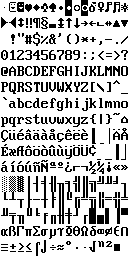
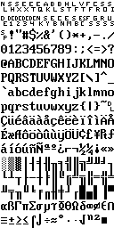
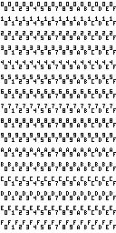
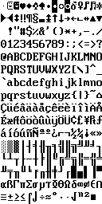

# DSC-216 Display Board by Humusoft

Humusoft seems to do data acquisition and control boards. This board has a copyright 1992,1994 revision 1.30 with a date of 09/20/94 and prints a copyright "ELC 1.11 ROM 1.30"

The display board als is based around a 68008 CPU. It communicates with the main unit via a serial interface, which is VT100 based for the 80x25 screen and sends keyboard codes back for key-presses (low byte first, which is the ASCII code, the high byte is for cursor keys, etc). It looks like a very generic board, which could be used for other hardware, except the firmware has the keyboard matrix hardcoded.

4 Fonts are part of the ROM, which can be rendered via the `Font_Firmware_Renderer.py` as png.

## ICs on the board:

- 1x Motorola MC68008FN8
- 1x Motorola MC68681FN for the communication with the main unit
- 1x Motorola MC68B45P for the video display
- 1x Intel P8279-5 at the keyboard decoder
- 3x Cypress CY7C199-25vc (32K x 8 SRAM)

## Memory map

- 0x00000000 - 0x00007FFF 32KB ROM
- 0x00010000 - 0x0001FFFF 64KB SRAM
- 0x00030000 - 0x00030000 DIP Switches
- 0x00040000 - 0x00040003 Intel P8279 (2 registers on the even addresses)
- 0x00050000 - 0x00057FFF 32KB SRAM as video memory for the MC68B45P
- 0x00060000 - 0x00060003 MC6845 (2 registers on the even addresses)
- 0x00070000 - 0x0007001F MC68681 (16 registers on the even addresses)

## MC68681

Buffer A is used to communicate with the main unit.
Buffer B is used to read keys from an IBM AT compatible keyboard.

The parallel port is used for outputting some bits.

- 0 Signal beeper, used for the BEL sound
- 1 not written to
- 2 not written to
- 3 used for bit banging communicated with the IBM AT keyboard
- 4 not written to
- 5 Select Video RAM page 0/1
- 6 Set if Video RAM page 0 fails the memory test. System then switches to page 1.
- 7 Enable cursor keys

## DIP Switches

The DIP switches are not populated on my board, but they are read by the firmware.

- 0-2 Baudrate (0:300, 1:600, 2:1200, 3:2400, 4:4800, 5:9600, 6:19200, 7:19200, BRF off)
- 3 Enable XON/XOFF support for serial communication
- 4 0:With Parity, 1:No Parity (do not work, because of SW#6)
- 5 0:7N, 1:8N Bits with odd parity (do not work, because of SW#6)
- 6 0:8N 1:8O (This overwrites the changes from SW#4 and SW#5)
- 7 Echo any keypress to the display

## VT100 implementation

The communication with the display is a modified VT100 implementation. Many ESC codes are not implemented, some additional ones were added and some defined ones are actually implemented as something completely different!

	0x07 BEL		Makes an audible noise.
	0x08 BACKSPACE	Moves the cursor left (but may "backwards wrap" if cursor is at start of line).
	0x09 TAB		Cursor to next tab position
	0x0A LF			Cursor into the next line
	0x0C FORMFEED 	Erase screen
	0x0D CR			Moves the cursor to column zero.
	0x7F DEL		Processes the following character without parsing, e.g. ESC or XON/XOFF
	0x9B			Acts as Control Sequence Introducer, ESC and [ in one byte
	
	ESC E			Cursor to the beginning of the next line, scroll screen up, of necessary
	ESC H			Set a tab at the current column
	ESC Y			Returns 0 (IBM AT keyboard not detected), 1 (IBM AT keyboard detected) or ? (internal keypad active)
	ESC Z			Terminal identification (returns: ELC 1.11 ROM 1.30)
	ESC c			Reboots the terminal
	ESC [			Control Sequence Introducer (CSI)
	
	ESC [<n>A		Move cursor up n lines
	ESC [<n>B		Move cursor down n lines
	ESC [<n>C		Move cursor right n lines
	ESC [<n>D		Move cursor left n lines
	ESC [<n>F		Select font n (0-3)
	ESC [<v>;<h>H	Move cursor to screen location v,h (without v or h: to the upper left corner)
	ESC [0J			Clear screen from cursor down
	ESC [1J			Clear screen from cursor up
	ESC [2J			Clear entire screen
	ESC [0K			Clear line from cursor right
	ESC [1K			Clear line from cursor left
	ESC [2K			Clear entire line
	ESC [0L			Clear screen from cursor down
	ESC [1L			Clear screen from cursor up
	ESC [2L			Form Feed
	ESC [<n>S		Scroll whole page up by n (default 1) lines
	ESC [<n>T		Scroll whole page down by n (default 1) lines
	
	ESC [0g			Clear a tab at the current column
	ESC [3g			Clear all tabs
	
	ESC [2h			Disable keyboard
	ESC [<1h		Keyboard repeat delay on
	ESC [<2h		Set cursor height to 0
	ESC [?1h		Clear Bit 7 on the output port
	ESC [?7h		Set auto-wrap mode
	ESC [?8h		Set auto-repeat mode
	ESC [?25h		Shows the cursor
	
	ESC [0i			Select external IBM AT keyboard
	ESC [1i			Select internal keypad
	
	ESC [0;<n>j		Set keyboard indicator
	ESC [2j			Keyboard uppercase on
	ESC [?j			Return currently pressed key
	
	ESC [2l			Enable keyboard
	ESC [<1l		Reset keyboard repeat delay
	ESC [<2l		Reset cursor height
	ESC [?5l		Set Bit 7 on the output port
	ESC [?7l		Reset auto-wrap mode
	ESC [?8l		Reset auto-repeat mode
	ESC [?25l		Hides the cursor
	
	ESC [0m			Turn off character attributes
	ESC [4m			Turn blink cursor on
	ESC [5m			Turn upperline mode on (opposite of underline)
	ESC [6m			Turn underline mode on
	ESC [7m			Turn reverse video on
	ESC [24m		Turn blink cursor off
	ESC [25m		Turn upperline mode off
	ESC [26m		Turn underline mode off
	ESC [27m		Turn reverse video off
	ESC [4;<v>;<h>;<o>m	Set cursor position (v,h)
	
	ESC [?15n		Get cursor position (Response is: ^[<v>;<h>;r)
	ESC [<n>p		Send screendump from cursor position (n words, LSB first, up to 2000)
	ESC [<cmin>;<vmin>;<cmax>;<vmax>r	Define output window
	ESC [<<n>s		Set font width (1-4)
	ESC [<<n>t		Set keyboard delay timer (1-21)
	ESC [?<n>t		Set keyboard repeat timer (1-11)
	
## VT100 Fonts

The default font is a modified CP437 with some addition line drawing characters

The default font is a modified CP437 with the control characters as hex images

This is a hex image font

The original CP437 font

